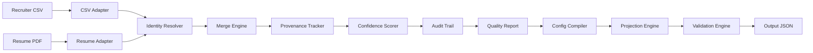

# Candidate Canonicalization Engine (CCE)

Transform multiple candidate sources into a single canonical profile with deterministic merge policies, full provenance, confidence scoring, and configurable projection.

## Architecture



## Pipeline

1. **Adapters** — Extract structured (CSV) and unstructured (PDF) candidate data
2. **Identity Resolution** — Score whether records belong to the same candidate
3. **Normalization** — Email, phone (E.164), skills, location
4. **Merge & Resolution** — Deterministic field-level merge with conflict tracking
5. **Provenance** — Trace every field to its source(s) and resolution policy
6. **Confidence Engine** — Deterministic per-field and overall confidence
7. **Audit Trail** — Detailed resolution metadata per field
8. **Quality Report** — Completeness, consistency, and trust scores
9. **Projection Engine** — Map canonical record to downstream schema via config
10. **Validation Engine** — Required-field checks with warnings and errors

The **canonical record remains immutable** after enrichment. Projection configs only affect projected outputs.

## Merge Policy Table

| Field | Policy | Notes |
|-------|--------|-------|
| `full_name` | Resume priority | Conflict recorded when values differ |
| `headline` | Resume priority | Conflict recorded when values differ |
| `years_experience` | Resume priority | Highest-confidence source |
| `location` | Highest confidence | Resume preferred when both present |
| `emails` | Union + dedupe | Normalized lowercase |
| `phones` | Union + dedupe | E.164 when valid; raw fallback |
| `skills` | Union + canonical | Alias map applied |
| `links` | Union + dedupe | |
| `experience` | Merge unique entries | |
| `education` | Merge unique entries | |

## Standout Features

- **Identity Resolution** — Email, phone, and name-similarity scoring
- **Conflict Report** — Every disagreement captured with selected value and reason
- **Enhanced Provenance** — Value, sources, method, and resolution policy per field
- **Audit Trail** — `_audit` block with competing values and confidence per field
- **Quality Report 2.0** — Completeness, consistency, trust, and composite quality score
- **Deterministic Confidence** — Source weights, agreement bonus, conflict/uncertainty penalties

## How to Run

```bash
pip install -r requirements.txt

python main.py \
  --csv sample_data/recruiter.csv \
  --resume sample_data/resume.pdf \
  --config configs/default.json \
  --output output/profile.json \
  --canonical-output output/canonical.json
```

Run tests:

```bash
pytest -q
```

## Config Examples

`configs/default.json`:

```json
{
  "fields": [
    {"path": "candidate_name", "from": "full_name", "required": true},
    {"path": "primary_email", "from": "emails[0]", "normalize": "email"},
    {"path": "primary_phone", "from": "phones[0]", "normalize": "E164"},
    {"path": "location_city", "from": "location.city"},
    {"path": "skills", "from": "skills", "normalize": "canonical"}
  ],
  "include_provenance": true,
  "include_confidence": true,
  "include_quality": true,
  "include_audit": true,
  "on_missing": "null"
}
```

### Missing Value Strategies

| Strategy | Behavior |
|----------|----------|
| `null` | Emit JSON `null` for missing fields |
| `omit` | Skip the field entirely |
| `error` | Raise validation error |

### Projection Features

- Nested path resolution (`location.city`, `emails[0]`)
- Field remapping (`from` → `path`)
- Normalizers: `email`, `E164`, `canonical`
- Toggles: confidence, provenance, quality, audit

## Edge Cases Handled

- Empty CSV or resume
- Missing phone/email
- Duplicate emails (case-insensitive dedupe)
- Duplicate phones
- Conflicting names/headlines
- Invalid/masked phone formats (`+91 9150XX9870`)
- Corrupted or unreadable PDF
- Unknown skills (passed through unchanged)
- Partial candidate records
- Multiple source agreement and conflict detection

## Sample Output

Projected output includes mapped fields plus optional metadata:

```json
{
  "candidate_name": "Mirthika G",
  "primary_email": "mirthika2005@gmail.com",
  "primary_phone": null,
  "location_city": null,
  "skills": ["python", "react"],
  "_confidence": {"full_name": 0.95},
  "_provenance": {"full_name": {"value": "Mirthika G", "sources": ["resume_pdf"], "method": "extraction"}},
  "_quality": {"quality_score": 82, "completeness_score": 73, "consistency_score": 88, "trust_score": 85},
  "_audit": {"headline": {"selected_source": "recruiter_csv", "resolution_policy": "resume_priority", "confidence": 0.80}}
}
```

The full canonical record (with `conflict_report`, `identity`, and all fields) can be written via `--canonical-output`.
