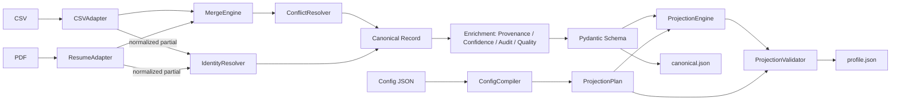
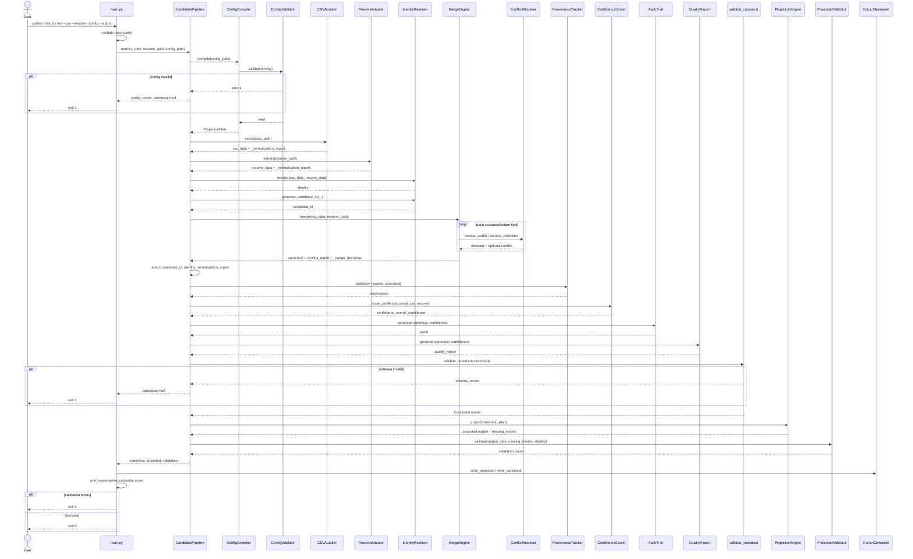
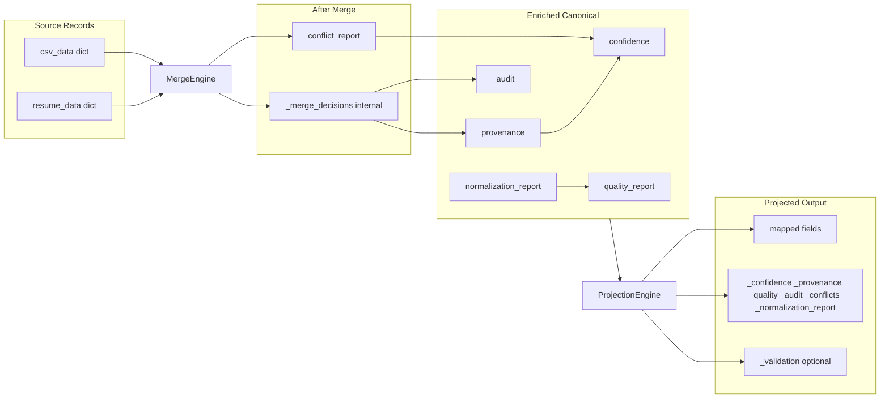

# Candidate Canonicalization Engine — Architecture

This document reflects the **actual implementation** in the codebase, not the original planned design.

## Compact Overview (One-Page)



## Repository Structure

```
eightfold/
├── main.py                          # Typer CLI entry point
├── configs/default.json             # Runtime projection config
├── sample_data/recruiter.csv
├── sample_data/resume.pdf
├── app/
│   ├── services/pipeline.py         # CandidatePipeline orchestrator
│   ├── adapters/                    # CSVAdapter, ResumeAdapter
│   ├── normalizers/                 # email, phone, skills, location, result
│   ├── merger/                      # identity, merge, conflict, provenance, audit
│   ├── confidence/scorer.py         # ConfidenceScorer
│   ├── quality/report.py            # QualityReport
│   ├── canonical/schema.py          # Pydantic Candidate + validate_canonical
│   ├── projection/                  # compiler, validator, projector, models
│   ├── validation/validator.py      # ProjectionValidator
│   └── output/generator.py          # OutputGenerator
└── tests/
```

## Pipeline Steps

| Step | Component | Output |
|------|-----------|--------|
| 1 | `ConfigCompiler.compile` | `ProjectionPlan` or early exit with `config_errors` |
| 2 | `CSVAdapter.extract` | Partial record + `_normalization_report` + `_uncertain_fields` |
| 3 | `ResumeAdapter.extract` | Partial record + `_normalization_report` + `_uncertain_fields` |
| 4 | `IdentityResolver.resolve` | `identity` (score + match_keys) |
| 5 | `IdentityResolver.generate_candidate_id` | `candidate_id` |
| 6 | `MergeEngine.merge` (uses `ConflictResolver`) | Core fields + `conflict_report` + `_merge_decisions` |
| 7 | `NormalizationReport.merge` | `normalization_report` on canonical |
| 8 | `ProvenanceTracker.build` | `provenance` |
| 9 | `ConfidenceScorer.score_profile` | `confidence` + `overall_confidence` |
| 10 | `AuditTrail.generate` | `_audit` |
| 11 | `QualityReport.generate` | `quality_report` |
| 12 | `validate_canonical` | Pydantic `Candidate` (structured error on failure) |
| 13 | `ProjectionEngine.project` | `ProjectionResult` (output + missing_events) |
| 14 | `ProjectionValidator.validate` | validation report (errors/warnings) |
| 15 | `OutputGenerator` | Write JSON files; CLI exit codes |

## Sequence Diagram



## Data Flow



### Normalization tiers

1. **Adapter extract** — email, phone, location (`csv_adapter.py`, `resume_adapter.py`)
2. **Merge** — skills canonicalization, location re-parse, email/phone detailed candidates (`merge_engine.py`)
3. **Projection** — optional per-field `email`, `E164`, `canonical` (`projector.py`)

### Validation tiers

1. **Config compile** — `ConfigValidator` (blocks pipeline)
2. **Canonical schema** — Pydantic `Candidate` (returns `schema_errors` on failure)
3. **Post-projection** — `ProjectionValidator` (errors/warnings; CLI exit 1 on errors)

## Component Glossary

| Name | Class / file | Description |
|------|--------------|-------------|
| CLI | `main.py` | Typer entry point; validates paths, invokes pipeline, delegates file writes to OutputGenerator |
| CandidatePipeline | `app/services/pipeline.py` | Orchestrates config compile → extract → identity → merge → enrich → schema validate → project → validate |
| CSVAdapter | `app/adapters/csv_adapter.py` | Reads first CSV row via pandas; normalizes email/phone/location |
| ResumeAdapter | `app/adapters/resume_adapter.py` | Extracts PDF text via PyMuPDF; regex-parses fields; normalizes contact data |
| Normalizers | `app/normalizers/` | email, phone (E.164), skills (alias map), location (city/country struct) |
| IdentityResolver | `app/merger/identity_resolver.py` | Scores email/phone/name match; generates deterministic `candidate_id` |
| MergeEngine | `app/merger/merge_engine.py` | Field-level deterministic merge; delegates conflicts to ConflictResolver |
| ConflictResolver | `app/merger/conflict_resolver.py` | Resolves scalar/collection conflicts with explicit policies |
| ProvenanceTracker | `app/merger/provenance.py` | Per-field source history, method, resolution policy, item-level traceability |
| ConfidenceScorer | `app/confidence/scorer.py` | Per-field and overall confidence from weights, bonuses, and penalties |
| QualityReport | `app/quality/report.py` | Completeness, consistency, trust, and composite quality_score |
| AuditTrail | `app/merger/audit.py` | `_audit` block with selected value, candidates, policy, confidence per field |
| ConfigCompiler | `app/projection/compiler.py` | Loads JSON config, validates, compiles into ProjectionPlan |
| ConfigValidator | `app/projection/config_validator.py` | Validates field rules, on_missing, include flags at compile time |
| ProjectionEngine | `app/projection/projector.py` | Maps canonical fields to downstream schema via path resolution and toggles |
| ProjectionValidator | `app/validation/validator.py` | Post-projection required-field, missing-value, and identity warnings |
| validate_canonical | `app/canonical/schema.py` | Pydantic Candidate model validation (non-mutating) |
| OutputGenerator | `app/output/generator.py` | Writes projected and canonical JSON to disk |

## Implementation vs. Planned Design

| Area | Planned / old README | Actual implementation |
|------|----------------------|----------------------|
| Config timing | ConfigCompiler after enrichment | ConfigCompiler runs **first** |
| Normalization | Standalone pipeline stage | **Embedded** in adapters, merge, and projection |
| Conflict resolution | Separate stage after merge | **Sub-component** of MergeEngine |
| Class naming | ProvenanceEngine, ValidationEngine | `ProvenanceTracker`, `ProjectionValidator` |
| Identity gating | Check before merge | Score is advisory; warning only at validation |
| Skills in CSV | Union from both sources | CSVAdapter does **not** extract skills |
| Resume skills | Normalized at extract | Keyword match at extract; `normalize_skills` at **merge** |
| `_merge_decisions` | Projected metadata | Internal only; used by ProvenanceTracker and AuditTrail |

## Known Gaps

- Identity score does not block merge; consider configurable enforcement for safety-critical use cases.
- CSV skills column is not supported; only resume contributes skills today.
- Adapters run sequentially; they could be parallelized for latency.
- `normalize_date` exists in `app/normalizers/date.py` but is not wired into the pipeline.
